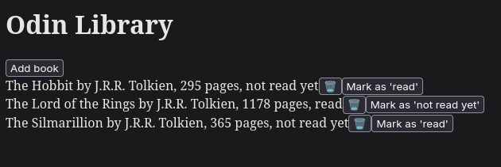

# Odin Library

Basic CRUD book library to practice Javascript fundamentals

It includes:

- A button to add a new book
- A button to delete a book
- A button to change the book from "Not read yet" to "Read" and vice versa

## Live Demo

Check out [here]()

## Project Specifications on TOP Curriculum

[https://www.theodinproject.com/lessons/node-path-javascript-library](https://www.theodinproject.com/lessons/node-path-javascript-library)

## TODO

- [ ] Style with CSS
- [ ] Create Unit Tests
- [ ] Create local storage to preserve the library contents
